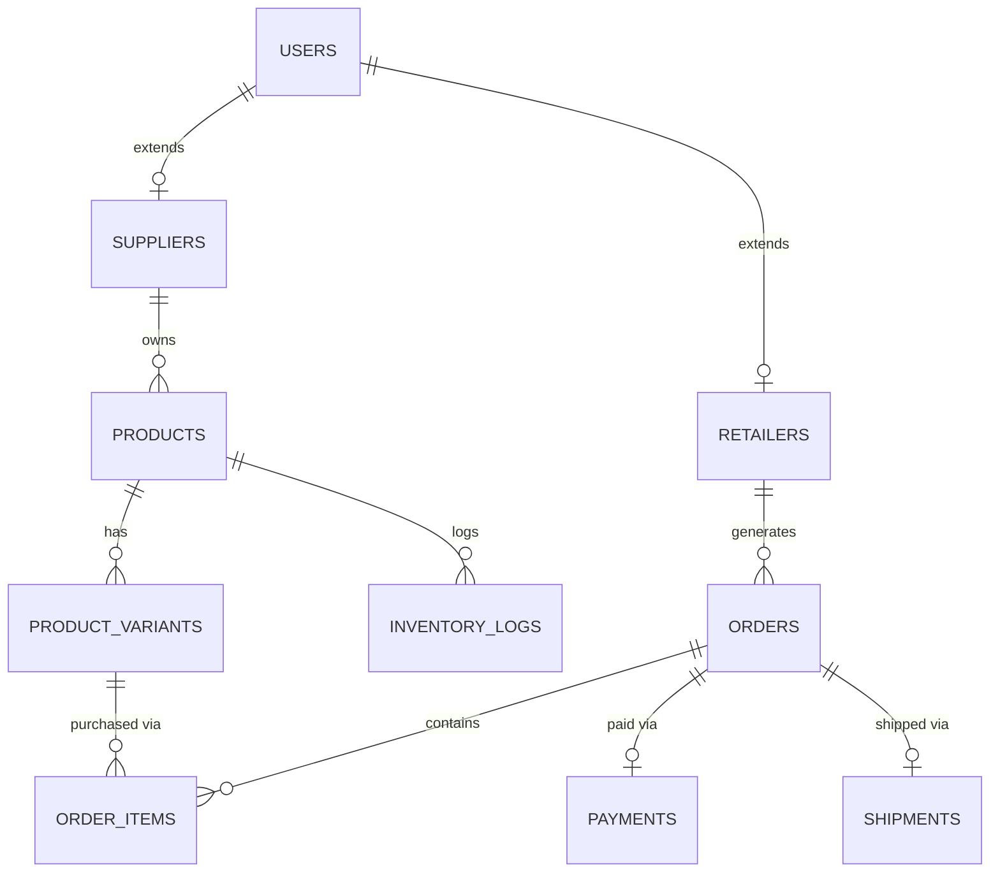

# DATABASE DESIGN
## Rozi Khan Dropshipping Platform

**Document Version:** 1.0
**Author:** Senior Database Architect

---

## 1. Database Overview
The Rozi Khan platform utilizes a highly normalized, relational database architecture powered by **PostgreSQL 15+**. The design prioritizes data integrity, concurrent transaction safety (critical for inventory management), and read-heavy query optimization (critical for catalog browsing and analytics). All primary keys are UUIDs (or preserved 24-char hex strings for legacy compatibility) to ensure global uniqueness and prevent ID-enumeration vulnerabilities.

## 2. ER Diagram (Simplified Core)

---

## 3. User Tables
### Table: `users`
**Purpose:** Central authentication and identity table for all actors (Admin, Supplier, Retailer, Customer).
* **Fields:** 
  * `id` (VARCHAR(36), PK)
  * `email` (VARCHAR(255), UNIQUE, NOT NULL)
  * `password_hash` (VARCHAR(255), NOT NULL)
  * `role` (VARCHAR(50), NOT NULL) - Enum: ADMIN, SUPPLIER, RETAILER, CUSTOMER
  * `is_email_verified` (BOOLEAN, Default: false)
  * `created_at` (TIMESTAMP, Default: NOW())
  * `updated_at` (TIMESTAMP, Default: NOW())
* **Constraints:** Unique on `email`.
* **Relationships:** Base table for `suppliers` and `retailers`.
* **Indexing Strategy:** B-Tree index on `email` (login lookup), B-Tree on `role`.

---

## 4. Supplier Tables
### Table: `suppliers`
**Purpose:** Stores supplier-specific business profiles and verification statuses.
* **Fields:**
  * `user_id` (VARCHAR(36), PK)
  * `company_name` (VARCHAR(255), NOT NULL)
  * `tax_id` (VARCHAR(100))
  * `verification_status` (VARCHAR(50), Default: PENDING)
  * `warehouse_address` (TEXT)
* **Constraints:** `user_id` must reference a user with `role = 'SUPPLIER'`.
* **Relationships:** Foreign Key `user_id` -> `users(id)`.
* **Indexing Strategy:** B-Tree index on `verification_status`.

### Table: `supplier_documents`
**Purpose:** Stores KYC and tax compliance documents.
* **Fields:** `id` (PK), `supplier_id` (FK), `document_type` (VARCHAR), `file_url` (TEXT), `uploaded_at` (TIMESTAMP).

---

## 5. Retailer Tables
### Table: `retailers`
**Purpose:** Stores retailer-specific profiles and active subscription tiers.
* **Fields:**
  * `user_id` (VARCHAR(36), PK)
  * `store_name` (VARCHAR(255), NOT NULL)
  * `subscription_plan_id` (VARCHAR(36), FK)
  * `onboarding_completed` (BOOLEAN, Default: false)
* **Constraints:** `user_id` must reference a user with `role = 'RETAILER'`.
* **Relationships:** Foreign Key `user_id` -> `users(id)`.

---

## 6. Product Tables
### Table: `products`
**Purpose:** The master catalog of all dropshippable items.
* **Fields:**
  * `id` (VARCHAR(36), PK)
  * `supplier_id` (VARCHAR(36), FK)
  * `title` (VARCHAR(255), NOT NULL)
  * `description` (TEXT)
  * `base_wholesale_price` (NUMERIC(10,2), NOT NULL)
  * `suggested_retail_price` (NUMERIC(10,2))
  * `status` (VARCHAR(50), Default: ACTIVE)
  * `created_at` (TIMESTAMP)
* **Constraints:** Cannot be deleted if tied to an active order.
* **Relationships:** Belongs to `suppliers`. Has many `product_variants`.
* **Indexing Strategy:** B-Tree index on `supplier_id` and `status`. GIN/GiST index on `title` and `description` for fast full-text search.

---

## 7. Variant Tables
### Table: `product_variants`
**Purpose:** Stores distinct variations of a product (e.g., Red-XL, Blue-M) and their specific SKUs.
* **Fields:**
  * `id` (VARCHAR(36), PK)
  * `product_id` (VARCHAR(36), FK)
  * `sku` (VARCHAR(100), UNIQUE, NOT NULL)
  * `variant_name` (VARCHAR(255))
  * `price_override` (NUMERIC(10,2), Nullable)
* **Constraints:** Unique `sku`.
* **Relationships:** Foreign Key `product_id` -> `products(id)`.
* **Indexing Strategy:** B-Tree index on `sku` (frequent lookups during order routing).

---

## 8. Inventory Tables
### Table: `warehouse_stock`
**Purpose:** Real-time stock counts for variants.
* **Fields:**
  * `variant_id` (VARCHAR(36), PK, FK)
  * `available_stock` (INTEGER, Default: 0)
  * `reserved_stock` (INTEGER, Default: 0) - Stock tied to pending orders.
  * `incoming_stock` (INTEGER, Default: 0)
* **Constraints:** `available_stock` >= 0.

### Table: `inventory_logs`
**Purpose:** Append-only ledger for all stock movements (audit trail).
* **Fields:** `id` (PK), `variant_id` (FK), `change_amount` (INTEGER), `reason` (VARCHAR), `reference_id` (VARCHAR), `created_at` (TIMESTAMP).

---

## 9. Order Tables
### Table: `orders`
**Purpose:** Central record for all transactions routed through the platform.
* **Fields:**
  * `id` (VARCHAR(36), PK)
  * `retailer_id` (VARCHAR(36), FK)
  * `supplier_id` (VARCHAR(36), FK)
  * `total_wholesale_amount` (NUMERIC(10,2))
  * `status` (VARCHAR(50)) - Enum: PENDING, PAID, PROCESSING, SHIPPED, DELIVERED, CANCELLED.
  * `shipping_address_json` (JSONB)
  * `created_at` (TIMESTAMP)
* **Indexing Strategy:** Composite index on `(retailer_id, created_at)` and `(supplier_id, created_at)`. Hash index on `status`.

### Table: `order_items`
**Purpose:** Individual variants purchased within an order.
* **Fields:** `id` (PK), `order_id` (FK), `variant_id` (FK), `quantity` (INTEGER), `unit_wholesale_price` (NUMERIC).

---

## 10. Shipment Tables
### Table: `shipments`
**Purpose:** Logistics and tracking data per order.
* **Fields:** `id` (PK), `order_id` (FK, UNIQUE), `courier_name` (VARCHAR), `awb_number` (VARCHAR), `tracking_url` (TEXT), `label_url` (TEXT).
* **Indexing Strategy:** B-Tree index on `awb_number`.

---

## 11. Payment Tables
### Table: `payments`
**Purpose:** Captures gateway transactions (e.g., Razorpay) for wallet top-ups or direct order payments.
* **Fields:** `id` (PK), `order_id` (FK), `transaction_id` (VARCHAR, UNIQUE), `amount` (NUMERIC), `gateway` (VARCHAR), `status` (VARCHAR).

### Table: `commissions`
**Purpose:** Tracks platform revenue generated per order.
* **Fields:** `id` (PK), `order_id` (FK), `platform_fee` (NUMERIC), `supplier_payout` (NUMERIC), `payout_status` (VARCHAR).

---

## 12. Subscription Tables
### Table: `subscriptions`
**Purpose:** Manages retailer SaaS billing cycles.
* **Fields:** `id` (PK), `retailer_id` (FK), `plan_name` (VARCHAR), `status` (VARCHAR), `current_period_end` (TIMESTAMP).

---

## 13. Marketplace Integration Tables
### Table: `marketplace_connections`
**Purpose:** Stores OAuth tokens for Shopify, WooCommerce, etc.
* **Fields:** `id` (PK), `retailer_id` (FK), `platform_type` (VARCHAR), `store_url` (VARCHAR), `access_token` (TEXT), `refresh_token` (TEXT).

### Table: `product_mappings`
**Purpose:** Maps platform Variant IDs to external Marketplace Product IDs for sync.
* **Fields:** `id` (PK), `variant_id` (FK), `connection_id` (FK), `external_product_id` (VARCHAR).

---

## 14. Analytics Tables
### Table: `daily_revenue_summaries`
**Purpose:** Pre-aggregated metrics to speed up admin dashboards.
* **Fields:** `date` (DATE, PK), `total_orders` (INTEGER), `gmv` (NUMERIC), `total_commissions` (NUMERIC).

---

## 15. Notification Tables
### Table: `notifications`
**Purpose:** Internal alerts for users.
* **Fields:** `id` (PK), `user_id` (FK), `type` (VARCHAR), `message` (TEXT), `is_read` (BOOLEAN), `created_at` (TIMESTAMP).

---

## 16. Audit Tables
### Table: `audit_logs`
**Purpose:** Track critical system changes (e.g., admin overriding order statuses).
* **Fields:** `id` (PK), `actor_id` (FK), `action` (VARCHAR), `target_table` (VARCHAR), `target_id` (VARCHAR), `old_data` (JSONB), `new_data` (JSONB), `timestamp` (TIMESTAMP).

---

## Advanced Database Strategies

### Normalization Strategy
* The database conforms strictly to **3NF (Third Normal Form)** to eliminate data redundancy.
* Complex sub-documents (like Shipping Addresses) are stored as `JSONB` ONLY when they do not need to be individually queried/joined, improving read performance without breaking normal forms for queried relationships.

### Query Optimization
* **Avoid N+1 queries:** SQLAlchemy relies on `joinedload()` and `selectinload()` to fetch related entities in a single batch query.
* **Full-Text Search:** Implementation of PostgreSQL `tsvector` and GIN indexing on `products.title` and `products.description` to allow lightning-fast keyword searches for Retailers browsing the catalog.

### Partitioning Strategy
* **Time-Series Partitioning:** The `inventory_logs`, `audit_logs`, and `orders` tables are heavily written to. They will utilize PostgreSQL declarative partitioning by range (`created_at` -> monthly partitions).
* **Why:** This ensures index trees for active current-month queries remain small, and allows easy archival of old log data by simply detaching historical partitions.

### Backup Strategy
1. **Automated Snapshots:** AWS RDS Automated Backups configured for daily snapshots with a 30-day retention period.
2. **Point-In-Time Recovery (PITR):** Write-Ahead Logging (WAL) enabled, allowing restoration to any exact second in the past 30 days.
3. **Cross-Region Replication:** Critical data is replicated asynchronously to a secondary AWS region (e.g., from `ap-south-1` to `ap-southeast-1`) for Disaster Recovery (DR).
