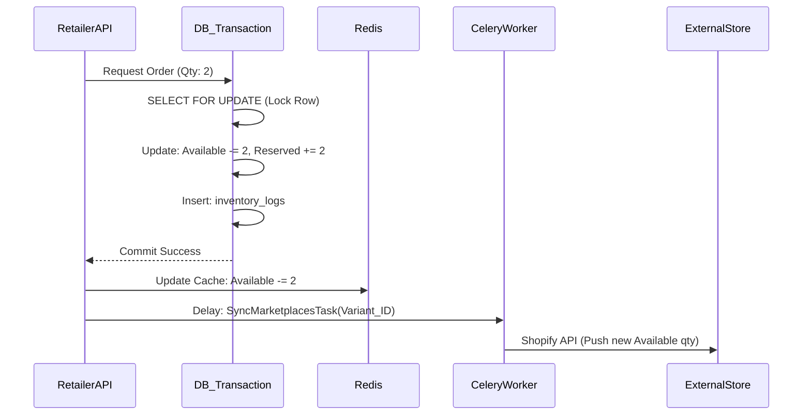

# INVENTORY SYNCHRONIZATION ENGINE
## Rozi Khan Dropshipping Platform

**Document Version:** 1.0
**Author:** Senior Inventory System Architect

---

## 1. Engine Overview
The Inventory Engine is the most critical and complex component of the dropshipping platform. It ensures that stock levels are perfectly synchronized between Suppliers, the Rozi Khan central database, and thousands of external Retailer storefronts (Shopify, WooCommerce) in near real-time, preventing overselling and financial losses.

---

## 2. Inventory States & Architecture

Inventory is not a single number; it is managed as a ledger of states to provide an accurate operational picture.

### 2.1 State Definitions
* **Available Stock:** Physically in the warehouse and ready to be sold immediately. (This is the number pushed to external marketplaces).
* **Reserved Stock:** Stock that has been purchased by a customer but has not yet been physically shipped by the supplier. (Deducted from Available, but still physically in the warehouse).
* **Incoming Stock:** Inventory currently in transit from a manufacturer to the supplier's warehouse.
* **Damaged Stock:** Items flagged during QA and unsellable.
* **Returned Stock:** Items returned by customers undergoing inspection before being moved back to Available or Damaged.

### 2.2 Formula
`Physical Warehouse Count = Available + Reserved + Damaged + Returned`

---

## 3. Database Design

### Table: `warehouse_stock`
* **Purpose:** Current snapshot of inventory states.
* **Fields:** `variant_id` (PK), `available_stock`, `reserved_stock`, `incoming_stock`, `damaged_stock`, `returned_stock`, `last_synced_at`.
* **Constraints:** `available_stock >= 0`. (PostgreSQL Check Constraint prevents negative stock at the database level).

### Table: `inventory_logs`
* **Purpose:** Immutable, append-only ledger of every single stock movement.
* **Fields:** `id`, `variant_id`, `state_changed` (e.g., 'AVAILABLE'), `change_amount` (+/-), `reason` (e.g., 'ORDER_PLACED', 'RESTOCK'), `reference_id` (Order ID/Restock ID), `timestamp`.

---

## 4. Concurrency Handling & Race Conditions

In a dropshipping model, hundreds of retailers might attempt to sell the last 1 item of a popular variant simultaneously. 

### 4.1 Prevention Strategies
1. **Row-Level Locking (Pessimistic Locking):**
   When an order is being placed, the transaction uses `SELECT ... FOR UPDATE` on the `warehouse_stock` row. This blocks other transactions from modifying that specific variant until the first transaction commits or rolls back.
2. **Database Constraints:**
   A hard `CHECK (available_stock >= 0)` constraint ensures that even if application logic fails, the database will reject the transaction with an IntegrityError.
3. **Atomic Operations:**
   Instead of `new_stock = old_stock - 1`, we use atomic updates: `UPDATE warehouse_stock SET available_stock = available_stock - 1 WHERE variant_id = X AND available_stock >= 1`.

---

## 5. Redis Architecture

To handle massive read volumes (retailers browsing catalogs), inventory is heavily cached in Redis.

* **Cache Structure:** `Hash` data type -> Key: `inventory:{variant_id}`, Fields: `available`, `reserved`.
* **Cache Invalidation:** When PostgreSQL is successfully updated, a Celery task immediately updates the Redis hash.
* **Pub/Sub Notifications:** Redis Pub/Sub is used to instantly push websocket notifications to the Retailer Dashboard if an item they are tracking goes out of stock.

---

## 6. Inventory Sync Workflow

### 6.1 Order Placement Workflow

### 6.2 Supplier Restock Workflow
* Supplier updates stock -> DB Updates -> Redis Updates -> Celery syncs new stock count to all linked Retailer stores.

---

## 7. Marketplace Inventory Sync (Celery Tasks)

External API calls to Shopify/WooCommerce are inherently slow and prone to rate limits. They must NEVER block the main FastAPI thread.

### 7.1 Celery Task: `sync_variant_inventory(variant_id)`
1. Fetch the new `available_stock` from the DB.
2. Query `product_mappings` to find all external stores (`connection_id`) that have imported this `variant_id`.
3. Group mappings by `connection_id`.
4. Spawn sub-tasks for each store: `push_inventory_to_store(connection_id, external_variant_id, stock_level)`.

---

## 8. Webhook Processing

External stores (e.g., Shopify) also send webhooks back to Rozi Khan when a product is deleted or altered externally.
* **Endpoint:** `POST /webhooks/shopify/inventory_levels/update`
* **Logic:** If an external store modifies inventory manually (bypassing Rozi Khan), the webhook triggers a Celery task that enforces the Rozi Khan database as the ultimate source of truth, aggressively overwriting the external store back to the correct wholesale level.

---

## 9. Error Recovery & Monitoring

* **Dead Letter Queues (DLQ):** If `push_inventory_to_store` fails (e.g., Shopify API is down), Celery applies an Exponential Backoff retry strategy (retry in 1m, 5m, 15m). After 5 failures, the task is moved to a DLQ for manual admin review.
* **Nightly Reconciliation:** A cron job runs at 3:00 AM UTC. It cross-references the sum of `inventory_logs` against the `warehouse_stock` table. If a discrepancy is found, an Admin alert is triggered.
* **Monitoring:** Datadog / Prometheus tracks metrics:
  - Cache Hit Ratio.
  - Number of DB Deadlocks.
  - Celery Queue Depth (Latency between a DB update and a Shopify push).

---

## 10. Scaling Strategy

1. **Database:** As the ledger grows, `inventory_logs` will be partitioned by month. 
2. **Celery Workers:** Dedicated worker queues:
   - `high_priority_queue`: Order placement deductions.
   - `marketplace_sync_queue`: Pushing updates to Shopify (scaled up dynamically via AWS Auto Scaling when queue depth exceeds 10,000 tasks).
3. **Redis:** ElastiCache Redis cluster with read-replicas. FastAPI reads from replicas; FastAPI/Celery writes to the primary node.
