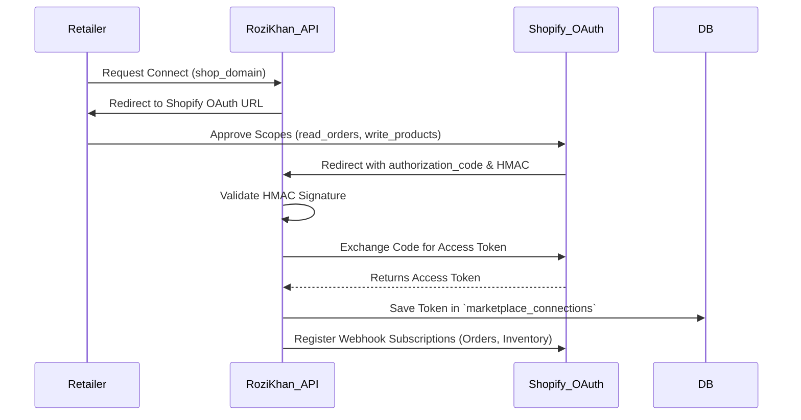

# MARKETPLACE INTEGRATIONS
## Rozi Khan Dropshipping Platform

**Document Version:** 1.0
**Author:** Senior Integration Architect

---

## 1. Module Overview
The Marketplace Integrations module is the bidirectional data bridge between the Rozi Khan platform and external e-commerce channels (Shopify, WooCommerce, Amazon, eBay). It translates localized data structures into platform-specific REST/GraphQL API calls, manages complex OAuth lifecycles, and processes high-throughput asynchronous webhooks for seamless catalog, order, and inventory synchronization.

---

## 2. Integration Architectures by Platform

### 2.1 Shopify
* **Auth Pattern:** Standard OAuth 2.0. Requires app installation via Shopify Partner Dashboard.
* **API Paradigm:** GraphQL Admin API (preferred for performance) and REST API (fallback).
* **Webhook Delivery:** Native Shopify Webhooks with HMAC-SHA256 signature validation.

### 2.2 WooCommerce
* **Auth Pattern:** REST API Key pair (Consumer Key & Consumer Secret).
* **API Paradigm:** Standard REST API.
* **Webhook Delivery:** Native WooCommerce Webhooks. (Requires platform URL verification).

### 2.3 Amazon (SP-API)
* **Auth Pattern:** Selling Partner API (SP-API) OAuth & STS (Security Token Service) AssumeRole credentials.
* **API Paradigm:** REST APIs with heavy use of async Feed and Report endpoints.
* **Webhook Delivery:** Amazon EventBridge or SQS (Simple Queue Service) subscriptions.

### 2.4 eBay
* **Auth Pattern:** OAuth 2.0 (User access tokens with refresh tokens).
* **API Paradigm:** RESTful Trading & Inventory APIs.
* **Webhook Delivery:** Event Notification API with challenge-response verification.

---

## 3. Core Sync Workflows

### 3.1 OAuth Authorization Flow (e.g., Shopify)

### 3.2 Product Push (Sync)
When a Retailer clicks "Import":
1. Rozi Khan translates the internal `Product` and `Variants` schemas to the target platform's schema.
2. Celery pushes images to the platform (or provides CDN links).
3. Base price is modified by Retailer's chosen markup margin.
4. Celery records the external `product_id` and `variant_id` returned by the target platform into `product_mappings`.

### 3.3 Inventory Sync (Outbound)
Triggered by a Supplier updating stock on Rozi Khan.
* **Shopify:** Update `InventoryLevel` GraphQL mutation.
* **WooCommerce:** Update product/variant `stock_quantity` via REST.
* **Amazon:** Submit an `Inventory Feed` XML/JSON via SP-API.

### 3.4 Order Sync (Inbound via Webhooks)
Triggered when an end-customer purchases an item on the external platform.
1. Webhook hits Rozi Khan endpoint (e.g., `/webhooks/shopify/orders/create`).
2. Payload HMAC is cryptographically verified to prevent spoofing.
3. API responds immediately with `200 OK` (crucial to prevent webhook timeouts).
4. Payload is dropped into a Redis Queue for Celery to parse.
5. Celery extracts Line Items, matches external Variant IDs to Rozi Khan Variant IDs via `product_mappings`, and routes the order.

---

## 4. API Limits & Rate Handling

Each platform enforces strict rate limiting. Rozi Khan implements the **Leaky Bucket** and **Exponential Backoff** algorithms to handle limits gracefully.

| Platform | Typical Rate Limit | Header Tracking | Handling Strategy |
| :--- | :--- | :--- | :--- |
| **Shopify** | 50 points/sec (GraphQL) | `X-Shopify-Shop-Api-Call-Limit` | Pause task execution if bucket capacity drops below 10%. |
| **WooCommerce** | Depends on hosting | N/A | Implement fixed 2 requests/sec delay per store connection. |
| **Amazon SP-API**| Token bucket (Varies per endpoint) | `x-amzn-RateLimit-Limit` | Catch `429 Too Many Requests`, requeue Celery task with exponential backoff (e.g., 2s, 4s, 8s). |

---

## 5. Background Tasks (Celery)

The integrations module relies entirely on asynchronous processing.
* `push_product_task`: Pushes new listings.
* `sync_inventory_task`: Dispatched fan-out task to update all mapped stores when wholesale stock changes.
* `process_inbound_order_task`: Validates webhook payloads and creates internal routing orders.
* `sync_tracking_task`: Pushes Courier tracking numbers back to the external platform and triggers customer shipment emails.

---

## 6. Database Tables (Integration Context)

| Table Name | Purpose | Key Fields |
| :--- | :--- | :--- |
| `marketplace_connections` | Platform credentials | `retailer_id`, `platform`, `store_url`, `access_token`, `refresh_token`, `expires_at` |
| `product_mappings` | ID Translation layer | `internal_variant_id`, `connection_id`, `external_product_id`, `external_variant_id` |
| `webhook_logs` | Audit trail for debugging | `id`, `platform`, `event_type`, `payload`, `processed_status`, `http_response` |

---

## 7. Error Handling & Retry Mechanisms

1. **Idempotency:** All inbound order webhook processing is idempotent. If Shopify fires the same `order/create` webhook twice, Redis checks the `external_order_id` against a TTL-locked cache to prevent duplicate wholesale billing.
2. **Exponential Backoff:** If an external API returns a `5XX Server Error` or `429 Too Many Requests`, the Celery task auto-retries `max_retries=5` times, with delays scaling exponentially `(2^retry_count) * base_delay`.
3. **Dead Letter Queue (DLQ):** If a task fails 5 times, it is routed to a DLQ. The Retailer's dashboard shows a "Sync Error" notification requiring manual intervention (e.g., their access token was revoked).

---

## 8. Monitoring & Scaling Strategy

### 8.1 Monitoring
* **Datadog APM:** Tracks the latency of external API calls.
* **Webhook Delivery Rate:** Alarms trigger if inbound webhook volume drops significantly (indicating a broken integration or expired SSL cert).
* **Token Expiration Monitor:** A daily cron job scans `marketplace_connections` for eBay/Amazon refresh tokens expiring in < 7 days and auto-refreshes them.

### 8.2 Scaling
* **Per-Platform Queues:** Celery workers are segregated by platform (e.g., `shopify_queue`, `amazon_queue`). This ensures a slow WooCommerce integration doesn't block fast Shopify syncs.
* **Bulk APIs:** Where possible (especially for Amazon and Shopify), the system uses Bulk APIs/Mutations to update 100 inventory levels in a single HTTP request rather than 100 separate requests.

---

## 9. Implementation Roadmap

**Phase 1: Foundation & Shopify (Weeks 1-4)**
* Build the OAuth handshake framework.
* Implement HMAC webhook verification middleware.
* Build Shopify GraphQL schemas for product creation and inventory updates.

**Phase 2: WooCommerce (Weeks 5-6)**
* Build REST API key ingestion.
* Implement WooCommerce webhooks verification.
* Standardize product translation schemas to abstract differences between Shopify and Woo.

**Phase 3: Advanced Marketplaces - Amazon & eBay (Weeks 7-10)**
* Amazon SP-API integration (Requires complex AWS IAM Role assumptions).
* eBay OAuth and Trading API implementation.
* Implement strict feed/report batch processing for Amazon compliance.

**Phase 4: Resilience & Optimization (Weeks 11-12)**
* Implement Redis-backed rate limiters for outbound calls.
* Setup Dead Letter Queues and Retailer "Sync Error" UI alerts.
* Implement automated integration testing using mock API endpoints.
