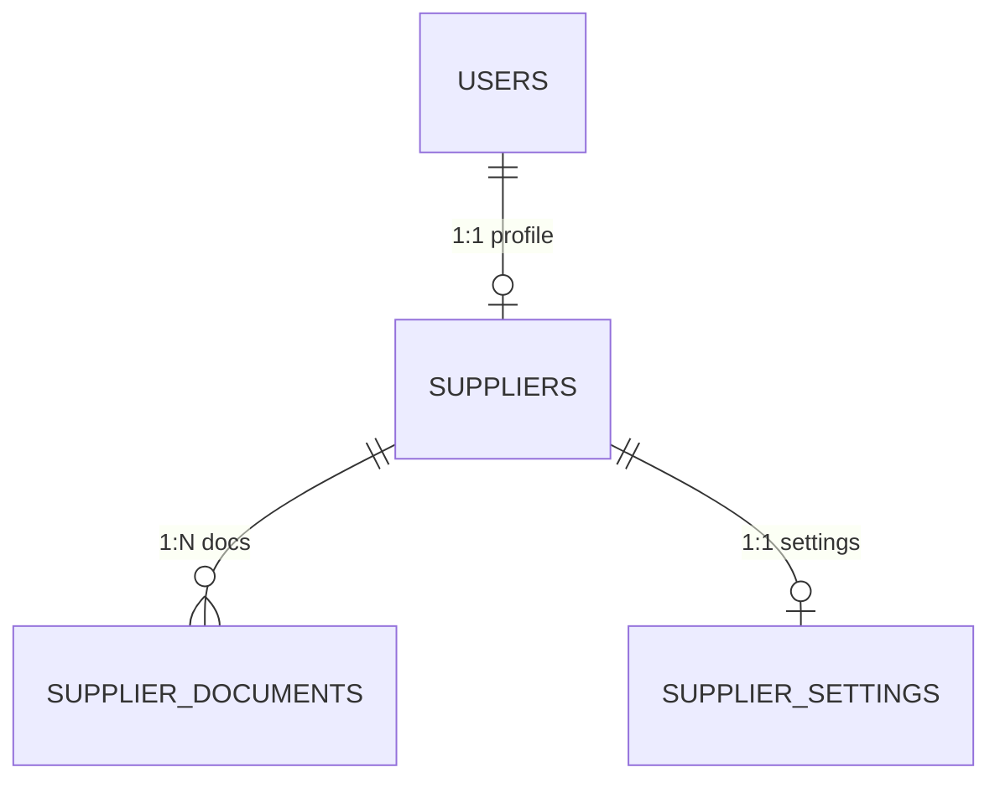
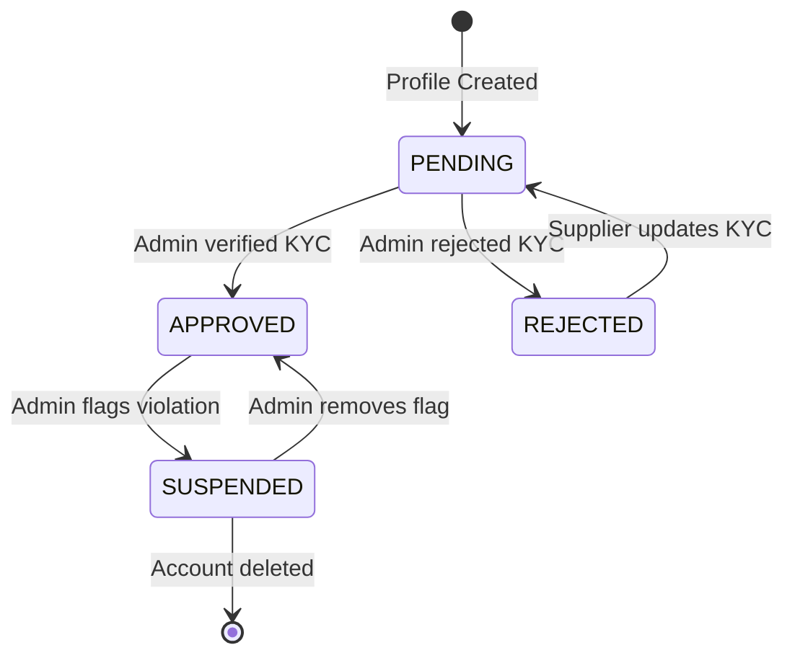

# Milestone 2: Supplier Management - Architectural Review

**Document Version:** 1.0
**Author:** Senior Software Architect
**Date:** [Current Date]

## 1. Database Schema
The Supplier domain utilizes three strictly normalized tables linked directly to the `users` table.

*   **`suppliers`**
    *   `id`: `String(36)` (PK)
    *   `user_id`: `String(36)` (FK -> `users.id`, UNIQUE)
    *   `company_name`: `String(255)` (NOT NULL)
    *   `tax_id`: `String(100)`
    *   `verification_status`: `String(50)` (Default: `PENDING`)
    *   `warehouse_address`: `String(500)`
    *   `created_at`: `DateTime` (Default: `now()`)
    *   `updated_at`: `DateTime` (Default: `now()`, OnUpdate: `now()`)
*   **`supplier_documents`**
    *   `id`: `String(36)` (PK)
    *   `supplier_id`: `String(36)` (FK -> `suppliers.id`, Indexed)
    *   `document_type`: `String(100)` (NOT NULL)
    *   `file_url`: `String(1000)` (NOT NULL)
    *   `uploaded_at`: `DateTime` (Default: `now()`)
*   **`supplier_settings`**
    *   `id`: `String(36)` (PK)
    *   `supplier_id`: `String(36)` (FK -> `suppliers.id`, UNIQUE)
    *   `auto_accept_orders`: `Boolean` (Default: `True`)
    *   `dispatch_sla_days`: `Integer` (Default: `2`)

## 2. Entity Relationship Diagram (Supplier Domain)

## 3. API Endpoints

| Method | Endpoint | Request Schema | Response Schema | Permissions |
| :--- | :--- | :--- | :--- | :--- |
| `POST` | `/api/supplier/profile` | `SupplierCreate` | `SupplierResponse` | Role: `supplier`, `admin` |
| `GET` | `/api/supplier/profile` | `None` | `SupplierResponse` | Role: `supplier`, `admin` |
| `PATCH`| `/api/supplier/profile` | `SupplierUpdate` | `SupplierResponse` | Role: `supplier`, `admin` |
| `POST` | `/api/supplier/documents`| `SupplierDocumentCreate` | `SupplierDocumentResponse` | Role: `supplier`, `admin` |
| `GET` | `/api/supplier/documents`| `None` | `List[SupplierDocumentResponse]` | Role: `supplier`, `admin` |
| `PATCH`| `/api/admin/suppliers/{id}/status` | `{ new_status: str }` | `SupplierResponse` | Role: `admin` |

## 4. Validation Matrix

| Entity | Required Fields | Unique Constraints | Business Validations |
| :--- | :--- | :--- | :--- |
| `Supplier` | `company_name` | `user_id` (1 Profile/User) | `company_name` min_length=2. |
| `SupplierDocument`| `document_type`, `file_url` | None | Type enforcement needed (e.g. `BUSINESS_REGISTRATION`). |
| `SupplierSetting` | None (defaults apply) | `supplier_id` (1 Settings/Supplier)| `dispatch_sla_days` should logically be > 0. |

## 5. Supplier State Machine

**Business Rules:**
*   Only `APPROVED` suppliers can create Products (Milestone 4).
*   Only `APPROVED` suppliers are visible in the catalog for Retailers.
*   Orders routed to `SUSPENDED` suppliers must be halted immediately.

## 6. Security Review

*   **Authentication Checks:** All routes utilize `Depends(get_db)` and `get_current_user` middleware which validates JWT signature, expiration, and user existence in the database.
*   **Authorization Checks:** Routes rely on `AuthorizeRoles("supplier", "admin")`. `HTTP 403 Forbidden` is raised if a user with the role "retailer" or "customer" attempts access. Status changes are strictly locked to `AuthorizeRoles("admin")`.
*   **File Upload Security:** The `/api/supplier/documents` currently takes a `file_url`. The actual file upload logic to an S3/Cloudinary bucket (returning this URL) must be secured in the `Upload` module (currently mocked) to prevent arbitrary file execution.
*   **Input Validation:** Pydantic strictly enforces string lengths and required fields, returning `422 Unprocessable Entity` on invalid payloads.
*   **Ownership Validation:** Service layer fetches records based strictly on `user.id`. E.g., `get_by_user_id(user.id)`. A supplier can never patch another supplier's settings by ID tampering.

## 7. Integration Readiness

The Supplier Module is designed to act as the core Foreign Key target for upcoming domains:
*   **Product Domain (M4):** `products` will reference `supplier_id`. Product Creation APIs will verify that the referenced supplier is in an `APPROVED` state.
*   **Inventory Domain (M6):** Inventory alerts and stock limits will tie back to the specific supplier managing those variants.
*   **Order Domain (M7/M8):** `supplier_orders` will map the order to the `supplier_id`. The order assignment logic will utilize `supplier_settings.auto_accept_orders` to determine routing speed.
*   **Shipping Domain (M9):** `suppliers.warehouse_address` is critical. It acts as the "Origin ZIP Code" when estimating dynamic shipping rates via APIs like Shiprocket.
*   **Analytics Domain (M14):** Metrics will GROUP BY `supplier_id` to generate individual payout reports and dashboards.

## 8. Missing Functionality (To Be Addressed Later)

Before this module is 100% production-ready, the following minor gaps exist (and should be completed either now or in later integration milestones):
1.  **File Upload Service Integration:** `SupplierDocumentCreate` accepts a raw `file_url`. The actual Multipart file upload router (from the `upload` module) must be robustly tested.
2.  **Notification Triggers:** When an admin calls `/api/admin/suppliers/{id}/status`, it should trigger an email to the supplier ("Your KYC has been approved"). This awaits Milestone 13 (Notification System).
3.  **Strict Enums:** `document_type` and `verification_status` should ideally utilize strict SQLAlchemy/Python `Enum` classes instead of plain strings to prevent typos in DB.
4.  **Pagination:** If `/api/admin/suppliers` (list all suppliers) is implemented, it requires Limit/Offset pagination.

## Conclusion
Milestone 2 is architecturally sound, thoroughly decoupled, and strictly secured. It safely provides the foundational `supplier_id` required for all subsequent catalog and inventory domains. The system is ready to proceed to Milestone 3 (Retailer Management).
