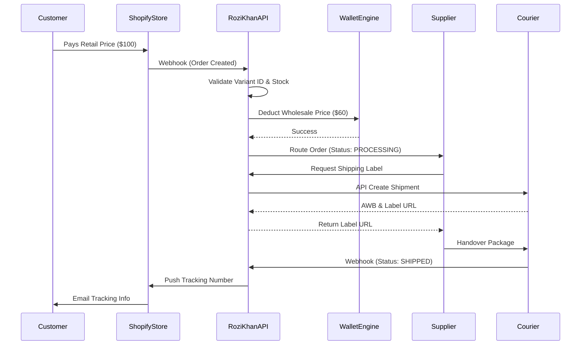

# ORDER ROUTING & FULFILLMENT
## Rozi Khan Dropshipping Platform

**Document Version:** 1.0
**Author:** Senior Logistics Architect

---

## 1. Module Overview
The Order Routing Engine is responsible for the end-to-end orchestration of transactions. It automatically detects a purchase on a Retailer's external storefront (like Shopify), captures wholesale funds from the Retailer's platform wallet, routes the fulfillment request to the appropriate Supplier(s), and syncs shipping tracking information back to the end-consumer.

---

## 2. Order Lifecycle & Statuses

An order on Rozi Khan moves through a strict state machine.

### 2.1 Standard Order Statuses
* `PENDING`: Order ingested, awaiting wallet deduction or inventory validation.
* `PAID`: Funds successfully captured from Retailer's wallet.
* `PROCESSING`: Routed to Supplier. Supplier has acknowledged and is packing the item.
* `SHIPPED`: AWB/Shipping Label generated and handed over to courier.
* `DELIVERED`: Courier confirmed delivery to Customer.
* `CANCELLED`: Cancelled before shipping (due to fraud, retailer request, or stock-out).

### 2.2 Exceptional Statuses
* `RMA_REQUESTED`: Return requested by Customer/Retailer.
* `RMA_APPROVED`: Supplier approved the return.
* `RMA_REJECTED`: Supplier rejected the return.
* `REFUNDED`: Funds returned to Retailer's wallet.

---

## 3. Core Workflows

### 3.1 Flow Diagram: End-to-End Automated Routing

### 3.2 Supplier Split Routing (Multi-Supplier Orders)
If a Retailer sells a "Headphone" (Supplier A) and a "T-Shirt" (Supplier B) in the same Shopify cart:
1. Rozi Khan ingests the master order.
2. The engine splits the order internally into `Sub-Order A` and `Sub-Order B`.
3. Separate routing requests are dispatched to Supplier A and Supplier B.
4. Two separate tracking numbers are synced back to Shopify for the respective line items.

---

## 4. Automation Rules

1. **Auto-Acceptance:** If the Retailer's wallet balance is `>=` the total wholesale + shipping cost, the order automatically transitions to `PROCESSING` without human intervention.
2. **Insufficient Funds:** If the wallet balance is low, the order remains `PENDING`. An urgent email/SMS is sent to the Retailer. If unfunded for 48 hours, the order is automatically `CANCELLED`.
3. **SLA Breach Auto-Flagging:** If an order remains in `PROCESSING` for more than the Supplier's stated `dispatch_days` (e.g., 2 days), the system flags the order as `OVERDUE` and alerts the Platform Admin.

---

## 5. Database Design (Order Context)

### Table: `orders`
* **Purpose:** Represents the routed fulfillment request to a specific supplier.
* **Fields:** 
  * `id` (PK)
  * `external_order_id` (VARCHAR) - Shopify/WooCommerce Order ID.
  * `retailer_id` (FK)
  * `supplier_id` (FK)
  * `status` (VARCHAR)
  * `total_wholesale_amount` (NUMERIC)
  * `total_shipping_amount` (NUMERIC)
  * `shipping_address_json` (JSONB)
  * `created_at`, `updated_at` (TIMESTAMP)

### Table: `order_items`
* **Purpose:** The variants attached to the specific order.
* **Fields:** `id`, `order_id` (FK), `variant_id` (FK), `quantity`, `unit_wholesale_price`.

### Table: `shipments`
* **Purpose:** Tracking data.
* **Fields:** `id`, `order_id` (FK), `courier_name`, `awb_number`, `tracking_url`, `label_url`.

### Table: `order_status_history`
* **Purpose:** Audit log for status changes.
* **Fields:** `id`, `order_id` (FK), `old_status`, `new_status`, `changed_by_user_id`, `timestamp`.

---

## 6. API Design (Module Specific)

* `POST /webhooks/shopify/orders/create` - Ingests external orders.
* `GET /orders` - Universal listing (Role-based: Retailers see their placed orders, Suppliers see their received orders).
* `GET /orders/{id}` - Detailed view including items and shipping info.
* `POST /orders/{id}/shipments` - Supplier generates a shipping label.
* `PATCH /orders/{id}/status` - Manual status override (Supplier/Admin).

---

## 7. Exception Handling

1. **Address Validation Failure:** Before capturing funds, the API validates the shipping address (via Courier API). If invalid, the order stays `PENDING` and alerts the Retailer to correct it on Shopify.
2. **Deadlocks & Race Conditions:** Uses `SELECT FOR UPDATE SKIP LOCKED` during high-concurrency order ingestions to ensure a background Celery worker only processes an order once.
3. **API Rate Limits (Shopify):** When pushing tracking numbers back to 50 Shopify stores simultaneously, Celery workers use exponential backoff to handle HTTP 429 Too Many Requests responses.

---

## 8. Returns & Refund Handling

### 8.1 RMA (Return Merchandise Authorization) Flow
1. Customer initiates return on Retailer's store.
2. Retailer clicks "Request Return" on Rozi Khan dashboard. (Status -> `RMA_REQUESTED`).
3. Supplier receives alert. Approves return based on policy (Status -> `RMA_APPROVED`).
4. Platform generates Reverse Pickup AWB via Courier.
5. Item arrives at Supplier. Supplier inspects.
6. Supplier clicks "Approve Refund".

### 8.2 Refund Ledger Logic
* When a refund is approved, the system creates a compensating ledger entry.
* The wholesale amount + shipping (if applicable) is credited back to the Retailer's `wallet`.
* The Commission engine reverses the platform fee for that transaction.

---

## 9. Scaling Considerations

* **Celery Queues:** Order ingestion webhooks respond `202 Accepted` immediately and offload the actual parsing, wallet deduction, and routing to a dedicated `order_processing_queue` in Celery.
* **Idempotency Keys:** Every incoming webhook payload must be processed using an Idempotency Key (usually the `external_order_id`) stored in Redis for 24 hours. This prevents the platform from accidentally charging a Retailer twice if Shopify sends duplicate webhooks due to network retries.
* **Archiving:** Orders older than 12 months are moved to an `orders_archive` cold storage table to maintain blazing fast query times on the active dashboard.
