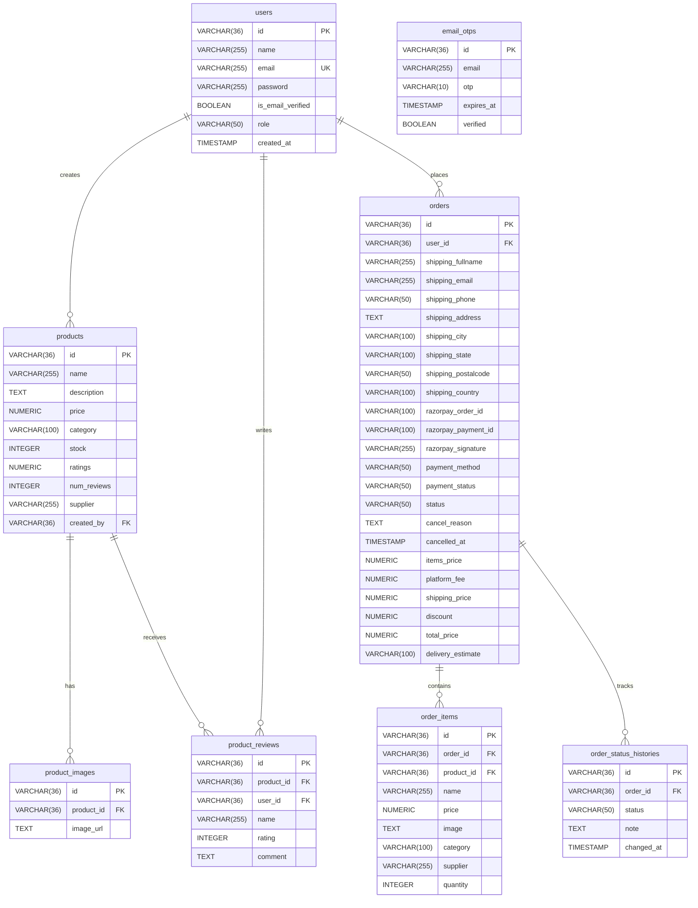
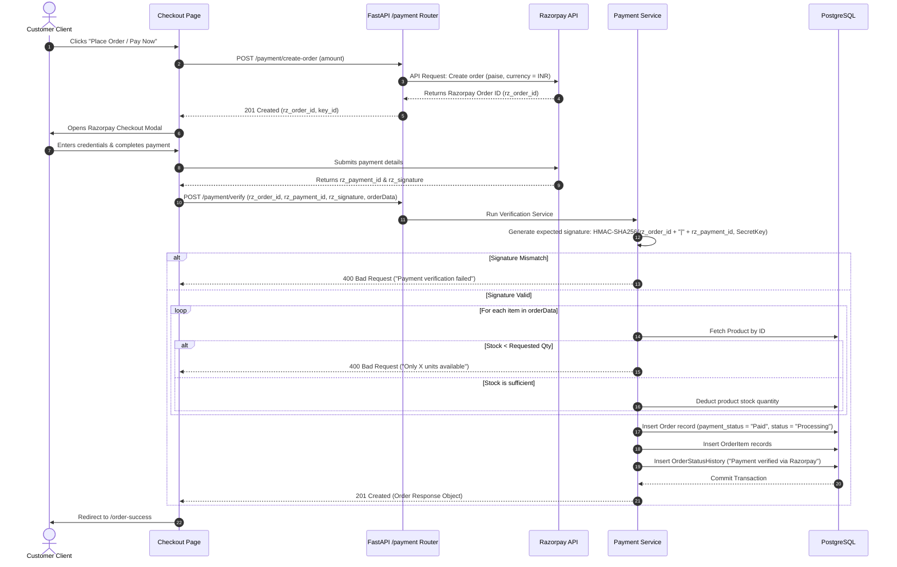
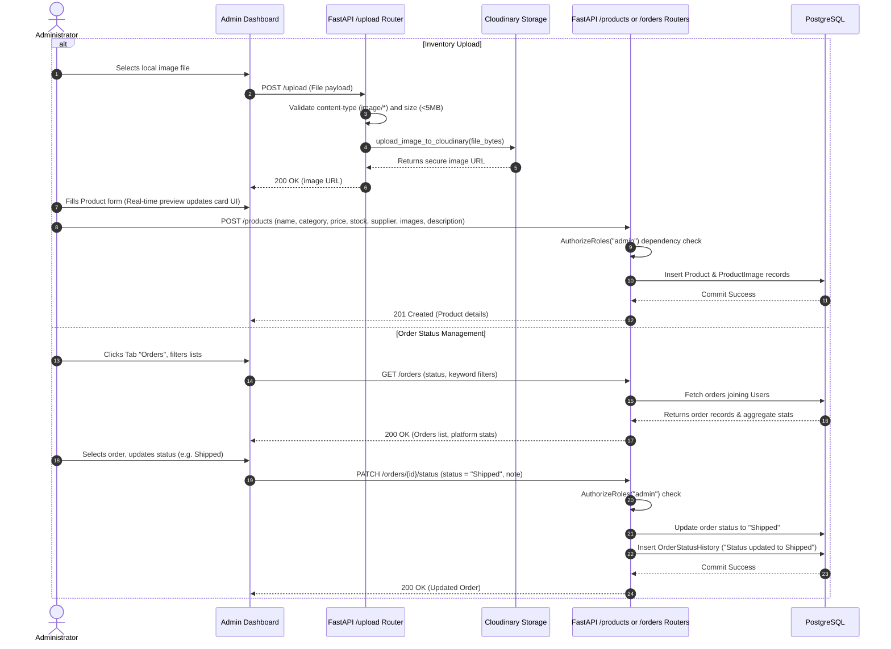

# RoziKhan Dropshipping Platform — Comprehensive Project Report & Flow Analysis

This technical report provides an exhaustive, fundamental analysis of the **RoziKhan Dropshipping Platform**. It covers the complete architecture, codebase design patterns, relational database schemas, detailed user and API flows, and core helper implementations. 

---

## 1. Executive Summary & Project Overview

**RoziKhan** is a premium dropshipping marketplace and catalog management application designed for sellers, suppliers, and administrators. 

### Core Tech Stack
*   **Frontend**: React (v19.2) scaffolded with Vite, styled with Tailwind CSS (v4.0), and routed using `react-router-dom` (v7.15).
*   **Backend**: Python FastAPI (v0.110) served by Uvicorn (dev) and Gunicorn (production).
*   **Database**: PostgreSQL relational database mapped using SQLAlchemy ORM (v2.0).
*   **Payment Gateway**: Razorpay (v1.4) SDK integration for client-side checkouts and secure backend cryptographic signature verification.
*   **Cloud Storage**: Cloudinary SDK integration for admin product image hosting.
*   **Email Client**: Resend (v0.8) API for delivering onboarding/registration verification codes.

### Migration Story & System Compatibility
Originally developed as a Node.js + Express + MongoDB application, the backend was completely ported to Python FastAPI and PostgreSQL. To prevent breaking client-side React code (which queries database records by MongoDB `_id` hex strings), the backend:
1.  Generates 24-character hexadecimal MongoDB-compatible ObjectIds for all new primary keys (e.g. `users`, `products`, `orders`).
2.  Utilizes custom Pydantic validators (`model_validator(mode='before')`) to transform normalized flat PostgreSQL relational columns (e.g., `shipping_fullname`, `shipping_address`) back into the nested structures (e.g., `shippingAddress: { fullName, address }`) and MongoDB `_id` alias fields expected by the frontend.

---

## 2. Directory Structure

```
RoziKhan/
├── backend/                        # Python FastAPI Backend
│   ├── app/
│   │   ├── middleware/             # Auth interceptors & role permission gates
│   │   ├── models/                 # SQLAlchemy ORM database models
│   │   ├── routers/                # FastAPI endpoint controllers
│   │   ├── schemas/                # Pydantic validation schemas
│   │   ├── services/               # Core business logic handlers
│   │   ├── utils/                  # Roles & helper functions
│   │   ├── config.py               # Pydantic-settings environment variables
│   │   ├── database.py             # DB engine, sessionmaker & get_db injection
│   │   └── main.py                 # Application entry point & CORS configuration
│   ├── migrations/                 # DB initialization SQL and ETL script
│   │   ├── 001_initial_schema.sql  # Initial Postgres table DDLs
│   │   └── 002_mongo_to_postgres.py# MongoDB Atlas to Postgres ETL script
│   ├── scripts/
│   │   └── reset_all_passwords.py  # Administrative password override script
│   ├── requirements.txt            # Python dependencies list
│   ├── nginx_rozikhan.conf         # Deployment Nginx configuration
│   └── rozikhan.service            # Systemd service file
│
├── frontend/                       # Vite + React Client
│   ├── public/                     # Static client files
│   ├── src/
│   │   ├── assets/                 # App logos & SVGs
│   │   ├── Components/             # Reusable UI controls
│   │   │   ├── routes/             # Route blockers (Protected, Admin, PublicOnly)
│   │   │   └── Navbar.jsx          # Dark mode & profile header navbar
│   │   ├── context/                # Global AuthContext & state providers
│   │   ├── hooks/                  # useAuth, useCart, useTheme custom hooks
│   │   ├── Pages/                  # Main routed page components
│   │   │   ├── Dashboard.jsx       # Seller control panel (Manage inventory/orders)
│   │   │   ├── Home.jsx            # Landing page
│   │   │   ├── Products.jsx        # Niche product showcase grid
│   │   │   ├── ProductDetail.jsx   # Product metrics, image slide, & reviews
│   │   │   ├── Cart.jsx            # Shopping cart management
│   │   │   ├── Checkout.jsx        # Address forms and Razorpay integration
│   │   │   ├── MyOrders.jsx        # Customer order history list
│   │   │   └── OrderDetail.jsx     # Order timeline & invoice details
│   │   ├── Services/               # Frontend API calls using Axios
│   │   ├── utils/                  # LocalStorage, theme, & currency helpers
│   │   ├── App.jsx                 # Client router configuration
│   │   └── main.jsx                # DOM mounting & rendering
│   └── package.json                # Frontend JS dependencies
│
└── uploads/                        # Local file fallback uploads folder
```

---

## 3. Database Schema Design (PostgreSQL Relational Mapping)

The database schema maps a formerly document-based MongoDB storage model into highly structured relational tables. Subdocuments and arrays are normalized into 1-to-many relationship tables:



### Table Details & Constraints
1.  **`users`**: Stores user profiles. Role defaults to `'user'`, but can be `'admin'`, `'seller'`, or `'supplier'`.
2.  **`email_otps`**: Stores short-lived registration codes. Includes `expires_at` and `verified` state.
3.  **`products`**: Inventory catalog. Connected to `users` via `created_by` (with `ON DELETE SET NULL` to retain product existence if an admin is deleted).
4.  **`product_images`**: Normalized from MongoDB arrays. Cascade deletes on product removal.
5.  **`product_reviews`**: Normalized from MongoDB arrays. Enforces a `UNIQUE(product_id, user_id)` constraint so that a customer cannot write multiple reviews for the same product.
6.  **`orders`**: Holds transaction history, payment IDs (Razorpay), totals, and address coordinates. Connected to `users` via `user_id` (`ON DELETE RESTRICT` protects audit trials).
7.  **`order_items`**: Subdocuments normalized from MongoDB orders. Foreign key reference `product_id` is nullable so that checkout history remains viewable even if the original product is deleted from the catalog.
8.  **`order_status_histories`**: Subdocuments normalized from orders. Automatically records a timeline of updates (e.g. `'Order placed by customer'`, `'Payment verified via Razorpay'`, `'Shipped'`).

---

## 4. End-to-End Application Flow

The operation of the platform relies on three major flow sequences: **User Authentication**, **Checkout & Razorpay Verification**, and **Admin Catalog/Order Management**.

### 4.1 User Authentication Flow

```mermaid
sequenceDiagram
    autonumber
    actor User as Customer Client
    participant API as FastAPI /auth Router
    participant Svc as Auth Service
    participant DB as PostgreSQL
    participant Email as Resend Email Service

    User->>API: POST /auth/send-otp (email)
    API->>Svc: Validate and check user exists
    alt User exists
        Svc-->>User: 400 Bad Request ("User already exists")
    else User is new
        Svc->>Svc: Generate 6-digit OTP
        Svc->>DB: Delete old OTPs; Insert new EmailOtp (expires in 10 mins)
        Svc->>Email: Send HTML OTP Email via Resend
        DB-->>Svc: Success
        Svc-->>User: 200 OK ("OTP sent to email")
    end

    User->>API: POST /auth/register (name, email, password, otp)
    API->>Svc: Validate password strength & OTP correctness
    Svc->>DB: Query verified OTP details in time limit
    alt OTP incorrect or expired
        Svc-->>User: 400 Bad Request ("Invalid/Expired OTP")
    else OTP matches
        Svc->>Svc: Hash password (bcrypt + sha256_crypt)
        Svc->>DB: Create User record (is_email_verified = True)
        Svc->>DB: Update EmailOtp verified = True
        DB-->>Svc: Success
        Svc-->>User: 201 Created (User Object)
    end

    User->>API: POST /auth/login (email, password)
    API->>Svc: Authenticate credentials
    Svc->>DB: Fetch user by email
    Svc->>Svc: Verify password hash match
    Svc->>Svc: Generate JWT Token (payload: user.id, role, exp: 7 days)
    Svc-->>User: 200 OK (JWT Token, User Profile)
```

---

### 4.2 Checkout and Payment (Razorpay Integration) Flow

This is the platform's core ecommerce transaction flow, ensuring inventory safety and secure cryptographic payment validation:



---

### 4.3 Seller Catalog and Order Fulfillment Flow

This workflow illustrates how administrators or sellers configure inventories and process dropshipping logistics:



---

## 5. Backend Endpoint Reference

The backend defines endpoints under a `/api` prefix, secured using JWT bearer headers.

### 5.1 Authentication (`/api/auth`)
*   `POST /auth/send-otp`: Sends a registration verification code.
*   `POST /auth/register`: Verifies OTP, hashes password, and creates a user account.
*   `POST /auth/login`: Validates password and generates a 7-day JWT token.
*   `GET /auth/profile`: Protected endpoint that returns the profile of the current authenticated user.

### 5.2 Products (`/api/products`)
*   `POST /products/`: (Admin only) Adds a new product catalog listing.
*   `GET /products/`: Public catalog search. Supports pagination (`page`, `limit`) and filters (`keyword`, `category`).
*   `GET /products/{id}`: Public route to fetch single product details, images, and reviews.
*   `PUT /products/{id}`: (Admin only) Updates inventory fields, pricing, or product images.
*   `DELETE /products/{id}`: (Admin only) Removes product catalog data.
*   `POST /products/{id}/reviews`: Authenticated route to add a rating (1-5) and review comment. Enforces one review per user.

### 5.3 Payments (`/api/payment`)
*   `GET /payment/key`: Returns the public Razorpay Key ID to initialize checkout modals.
*   `POST /payment/create-order`: Requests a signature-generating order ID from the Razorpay API.
*   `POST /payment/verify`: Verifies the payment's HMAC-SHA256 signature, validates product stocks, updates inventory levels, and saves the verified order.

### 5.4 Orders (`/api/orders`)
*   `POST /orders/`: Creates cash on delivery (COD) orders directly.
*   `GET /orders/`: (Admin only) Lists all database orders with optional filters, along with dashboard summaries (Total Revenue, Pending, Cancelled, Delivered).
*   `GET /orders/my-orders`: Returns the order history of the currently logged-in user.
*   `GET /orders/{id}`: Returns the detail layout, status logs, and tracking timelines for a single order.
*   `PATCH /orders/{id}/status`: (Admin only) Transitions order statuses and logs remarks.
*   `PATCH /orders/{id}/cancel`: Authenticated route enabling users to cancel orders (only allowed if the status is `'Pending'` or `'Processing'`).

### 5.5 File Uploads (`/api/upload`)
*   `POST /upload/`: (Admin only) Validates image inputs and hosts them on Cloudinary.

---

## 6. Detailed Code Walkthroughs (Core Fundamentals)

This section details how the platform implements critical features.

### 6.1 Database ObjectId Compatibility Helper
Because the frontend expects 24-character hexadecimal MongoDB ObjectIds, the backend implements a manual generator in `backend/app/utils/helpers.py`:

```python
import os
import time

def generate_object_id() -> str:
    """
    Generates a 24-character hexadecimal string compatible with MongoDB ObjectId format.
    4 bytes (timestamp) + 5 bytes (random) + 3 bytes (random counter) = 12 bytes = 24 hex characters.
    """
    timestamp = int(time.time())
    timestamp_bytes = timestamp.to_bytes(4, byteorder='big')
    random_bytes = os.urandom(5)
    counter_bytes = os.urandom(3)
    oid_bytes = timestamp_bytes + random_bytes + counter_bytes
    return oid_bytes.hex()
```

### 6.2 Cryptographic Payment Verification
To ensure clients do not spoof payments, `backend/app/services/payment.py` validates the signature before updating inventory levels and creating orders:

```python
import hmac
import hashlib
from fastapi import HTTPException, status
from app.config import settings

def verify_payment_service(req_data: PaymentVerificationRequest, user_id: str, db: Session):
    rz_order_id = req_data.razorpay_order_id
    rz_payment_id = req_data.razorpay_payment_id
    rz_signature = req_data.razorpay_signature
    
    # Cryptographic signature validation using HMAC-SHA256
    msg = f"{rz_order_id}|{rz_payment_id}"
    expected = hmac.new(
        key=settings.RAZORPAY_KEY_SECRET.encode("utf-8"),
        msg=msg.encode("utf-8"),
        digestmod=hashlib.sha256
    ).hexdigest()
    
    if not hmac.compare_digest(expected, rz_signature):
        raise HTTPException(
            status_code=status.HTTP_400_BAD_REQUEST,
            detail="Payment verification failed — invalid signature"
        )
    
    # (Proceed with inventory checks, database writes, etc.)
```

### 6.3 Relational Schema Adaptation in Pydantic
`backend/app/schemas/order.py` uses Pydantic's `model_validator` to rebuild nested address dictionaries from individual SQL database columns on serialization. This maintains compatibility with the frontend:

```python
from pydantic import BaseModel, Field, model_validator
from typing import Any, List

class OrderResponse(BaseModel):
    id: str = Field(..., alias="_id")
    shippingAddress: AddressSchema
    billingAddress: AddressSchema
    # (Other response fields)

    class Config:
        populate_by_name = True
        from_attributes = True

    @model_validator(mode='before')
    @classmethod
    def populate_addresses(cls, data: Any):
        if hasattr(data, 'shipping_fullname'):
            # Convert flat ORM model properties to nested schemas
            shipping = {
                "fullName": data.shipping_fullname,
                "email": data.shipping_email,
                "phone": data.shipping_phone,
                "address": data.shipping_address,
                "city": data.shipping_city,
                "state": data.shipping_state,
                "postalCode": data.shipping_postalcode,
                "country": data.shipping_country
            }
            billing = {
                "fullName": data.billing_fullname,
                "email": data.billing_email,
                "phone": data.billing_phone,
                "address": data.billing_address,
                "city": data.billing_city,
                "state": data.billing_state,
                "postalCode": data.billing_postalcode,
                "country": data.billing_country
            }
            return {
                **{k: getattr(data, k) for k in data.__dict__ if not k.startswith('_')},
                "shippingAddress": shipping,
                "billingAddress": billing,
                "order_items": getattr(data, 'order_items', []),
                "status_history": getattr(data, 'status_history', []),
                "user": getattr(data, 'user', None)
            }
        return data
```

---

## 7. Frontend Architecture and Global State

### 7.1 Router Protection Layout
The frontend defines three layers of route protection in `frontend/src/Components/routes/`:
1.  **`ProtectedRoute.jsx`**: Validates `isAuthenticated`. If not, redirects user to `/login` saving search locations inside React router state to enable redirection back post-login.
2.  **`AdminRoute.jsx`**: Wraps `ProtectedRoute` and checks `isAdmin` (validates if `user.role === "admin"`). If user is not authorized, redirects them to `/products`.
3.  **`PublicOnlyRoute.jsx`**: If the user is already authenticated, blocks them from seeing login/registration screens and redirects them to the homepage `/`.

### 7.2 Global AuthState Synchronization
Authentication state is kept inside an `AuthContext` provider. It attaches event listeners to window and storage objects, synchronizing login sessions across multiple browser tabs:

```javascript
useEffect(() => {
  window.addEventListener(authChangeEvent, refreshSession);
  window.addEventListener("storage", refreshSession); // Detects cross-tab changes

  return () => {
    window.removeEventListener(authChangeEvent, refreshSession);
    window.removeEventListener("storage", refreshSession);
  };
}, [refreshSession]);
```

---

## 8. Deployment Configurations

### 8.1 Gunicorn WSGI Config (`backend/gunicorn_config.py`)
Configures threads, workers, bind endpoints, and logging for production deployment:
```python
bind = "0.0.0.0:5000"
workers = 4
worker_class = "uvicorn.workers.UvicornWorker"
loglevel = "info"
accesslog = "-"
errorlog = "-"
```

### 8.2 Nginx Proxy Server (`backend/nginx_rozikhan.conf`)
Serves static React files on port 80 and reverse-proxies API calls under the `/api` prefix to the backend Gunicorn/FastAPI daemon:
```nginx
server {
    listen 80;
    server_name rozikhan.com;

    location / {
        root /var/www/rozikhan/frontend/dist;
        index index.html;
        try_files $uri $uri/ /index.html;
    }

    location /api {
        proxy_pass http://127.0.0.1:5000/api;
        proxy_http_version 1.1;
        proxy_set_header Upgrade $http_upgrade;
        proxy_set_header Connection 'upgrade';
        proxy_set_header Host $host;
        proxy_cache_bypass $http_upgrade;
    }

    location /uploads {
        alias /var/www/rozikhan/backend/uploads;
        add_header Access-Control-Allow-Origin *;
    }
}
```

### 8.3 Systemd Daemon Config (`backend/rozikhan.service`)
Enables production system startup persistence, daemon monitoring, and recovery management:
```ini
[Unit]
Description=RoziKhan Dropshipping FastAPI Backend Daemon
After=network.target

[Service]
User=ubuntu
WorkingDirectory=/var/www/rozikhan/backend
Environment="PATH=/var/www/rozikhan/backend/venv/bin"
EnvironmentFile=/var/www/rozikhan/backend/.env
ExecStart=/var/www/rozikhan/backend/venv/bin/gunicorn -c gunicorn_config.py app.main:app
Restart=always

[Install]
WantedBy=multi-user.target
```

---

## Summary of Findings & Core Strengths
1.  **Architecture**: Clean decoupling of static client UI assets from backend API workers.
2.  **Safety**: Enforced database schema constraints, foreign key referential actions (`CASCADE` vs. `RESTRICT`), and strict transactional updates prevent inventory drift.
3.  **Security**: Strong cryptography validation on payment receipt and user registration OTP limits.
4.  **Aesthetics & Usability**: Full responsive Tailwind v4 styles, multi-mode image uploads (Cloudinary and link ingestion), and local state synchronization.
