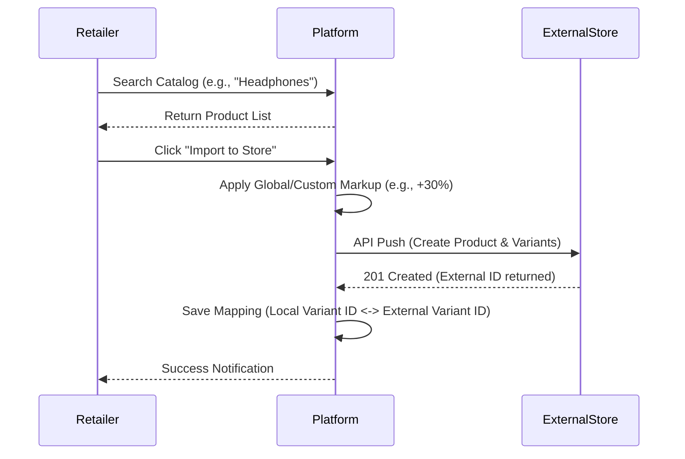

# RETAILER MODULE
## Rozi Khan Dropshipping Platform

**Document Version:** 1.0
**Author:** Senior Product Architect

---

## 1. Module Overview
The Retailer Module empowers independent e-commerce merchants to browse the Rozi Khan wholesale catalog, import products directly into their external storefronts (like Shopify or WooCommerce), and automatically route customer orders back to the platform for fulfillment. It acts as the demand-generation engine of the ecosystem.

---

## 2. Core Features & Workflows

### 2.1 Retailer Journey
1. **Registration:** Sign up, verify email, and complete basic profile setup.
2. **Subscription Selection:** Choose a SaaS tier based on required features (e.g., number of imports, number of integrations).
3. **Marketplace Connections:** Authenticate and link their Shopify/WooCommerce store via OAuth.
4. **Product Discovery:** Browse the catalog utilizing full-text search, category filters, and supplier ratings.
5. **Product Import:** Select products, define retail markup margins, and sync them to their external store.
6. **Order Fulfillment:** As customers buy on the external store, orders are pulled via Webhook/API to Rozi Khan and routed to the supplier.

### 2.2 Workflow Diagram: Product Discovery & Import

---

## 3. Retailer Dashboard Design

The UI focuses on growth, profitability, and operational ease.
* **Top KPIs:** Total Sales (Retail Value), Gross Profit (Retail - Wholesale), Active Listings, Pending Orders.
* **Sourcing Hub:** A curated feed of "Trending Products", "New Arrivals", and "High Margin Opportunities".
* **My Imports:** A grid managing all products pushed to their store (allowing bulk price updates or un-publishing).
* **Order Tracker:** A unified view of orders spanning from `Processing` to `Shipped` with linked tracking numbers.
* **Wallet/Billing:** Manage credit cards, view platform subscription invoices, and top-up the order wallet.

---

## 4. Analytics & Profit Tracking

* **Profit Calculation:** `Gross Profit = Total Retail Revenue (from external store) - (Total Wholesale Cost + Shipping Cost + Platform Commission)`.
* **Visualizations:** Line charts for 30-day revenue trends, pie charts for top-performing product categories.
* **Low Stock Alerts:** Notifications when an imported product's supplier stock falls below a threshold.

---

## 5. Database Design (Module Specific)

| Table Name | Purpose | Key Fields |
| :--- | :--- | :--- |
| `retailers` | Core profile | `user_id` (PK), `store_name`, `subscription_id`, `onboarding_status` |
| `marketplace_connections` | Store OAuth tokens | `id`, `retailer_id`, `platform` (Shopify/Woo), `store_url`, `access_token` |
| `imported_products` | Retailer's catalog | `id`, `retailer_id`, `product_id`, `retail_markup_pct`, `is_active` |
| `product_mappings` | ID translation | `id`, `variant_id`, `connection_id`, `external_product_id`, `external_variant_id` |
| `wallets` | Order funding source | `retailer_id` (PK), `balance`, `currency` |

*(Note: Orders and Subscription tables are shared but tightly integrated with Retailer workflows).*

---

## 6. API Design (Module Specific)

* `POST /retailers/register` - Create account.
* `GET /retailers/dashboard` - Fetch KPI and Profit metrics.
* `POST /marketplace/connect` - Save OAuth credentials for external stores.
* `POST /catalog/import` - Push a product to the connected external store.
* `GET /retailers/imports` - List all products currently synced.
* `PATCH /retailers/imports/{import_id}/markup` - Bulk update pricing margins.
* `POST /wallets/topup` - Add funds via payment gateway (Razorpay) to pay for wholesale orders.

---

## 7. User Stories

1. **As a Retailer**, I want to link my Shopify store with one click so I don't have to manually copy API keys.
2. **As a Retailer**, I want to set a global pricing rule (e.g., "Add 40% to wholesale cost") so I don't have to price hundreds of items individually.
3. **As a Retailer**, I want to see a clear breakdown of my Gross Profit per order so I understand my true margins.
4. **As a Retailer**, I want the tracking number from the supplier to automatically sync to my Shopify order so my customer is notified without my intervention.

---

## 8. Business Rules

1. **Wallet Funding:** A retailer's automated order routing will fail if their `wallet` balance is insufficient to cover the wholesale cost + shipping. 
2. **Import Limits:** The number of products a retailer can import is capped by their active SaaS subscription tier (e.g., Starter: 500 imports, Pro: 5,000 imports).
3. **Inventory Sync Strategy:** If a supplier's stock drops to 0, the platform must immediately dispatch a background task to set the external store's stock to 0 to prevent overselling.

---

## 9. Implementation Guide & Roadmap

### Phase 1: Onboarding & Infrastructure (Weeks 1-2)
* Implement Retailer registration and JWT auth.
* Build the Subscription Management layer (Plan selection, limits enforcement).
* Design the `wallets` system for pre-paid order funding.

### Phase 2: Catalog & Sourcing (Weeks 3-4)
* Develop the Product Discovery API (Full-text search, filtering, pagination).
* Build the `imported_products` local state management (allowing retailers to curate a list before pushing to their store).

### Phase 3: Marketplace Integrations (Weeks 5-7)
* Implement OAuth flow for Shopify.
* Build the Product Push Engine: Translate Rozi Khan product schemas to Shopify REST/GraphQL schemas.
* Build the `product_mappings` table logic to tie local IDs to remote IDs securely.

### Phase 4: Order Automation & Sync (Weeks 8-10)
* Set up Webhook listeners for Shopify Order Creation.
* Develop the Order Ingestion Engine: Parse incoming orders, validate inventory, deduct from wallet, and route to the respective Supplier(s).
* Develop the Inventory Sync Engine: Celery tasks that push supplier stock updates to all mapped external stores.

### Phase 5: Analytics & Polish (Weeks 11-12)
* Build the Profit Calculation API.
* Finalize Dashboard UI with Recharts/Chart.js integration.
* Comprehensive End-to-End testing of the Order Flow (Customer -> Shopify -> Rozi Khan -> Supplier).
