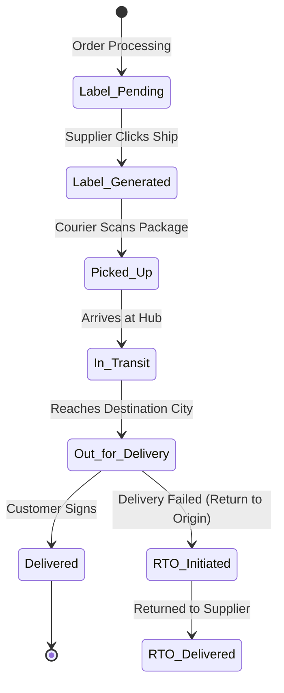

# SHIPPING SYSTEM
## Rozi Khan Dropshipping Platform

**Document Version:** 1.0
**Author:** Senior Logistics Architect

---

## 1. System Overview
The Shipping System acts as the logistical bridge between Suppliers and Customers. It abstracts the complexities of multiple courier partners (Shiprocket, Delhivery, FedEx, DHL) into a unified API, providing automated carrier selection, label generation, and real-time tracking updates synced back to the Retailer's storefront.

---

## 2. Core Workflows & State Machines

### 2.1 Shipment State Machine

### 2.2 Label Generation Flow
1. Supplier views order in `PROCESSING` state.
2. Clicks "Generate Label".
3. System determines optimal courier based on dimensions, weight, and destination ZIP code.
4. API call made to aggregator (e.g., Shiprocket).
5. AWB and PDF Label URL returned and displayed to Supplier.
6. Order status changes to `SHIPPED`.

---

## 3. Integrations Architecture

* **Shiprocket:** Primary aggregator for domestic (Indian) shipments.
* **Delhivery:** Direct API integration used as a failover for heavy/bulky B2B items.
* **FedEx / DHL:** Utilized for international cross-border dropshipping.

### 3.1 Courier Selection Logic
The system implements a Rule-Based Engine:
* If `Destination = International` -> Route to DHL.
* If `Weight > 50kg` -> Route to Delhivery Surface.
* Else -> Route to Shiprocket Auto-Assign algorithm (optimizing for lowest cost vs. highest SLA success).

---

## 4. Database Design (Shipping Context)

### Table: `shipments`
* **Fields:** `id` (PK), `order_id` (FK), `courier_id` (VARCHAR), `awb_number` (VARCHAR), `status` (VARCHAR), `label_url` (TEXT), `tracking_url` (TEXT), `shipping_cost` (NUMERIC), `created_at`.
* **Indexing:** B-Tree on `awb_number`.

### Table: `tracking_events`
* **Fields:** `id` (PK), `shipment_id` (FK), `event_location` (VARCHAR), `event_description` (TEXT), `timestamp` (TIMESTAMP).

---

## 5. API Design

* `POST /shipping/calculate-rate` - Estimates shipping cost (used during checkout).
* `POST /shipping/labels/generate/{order_id}` - Called by supplier to create AWB.
* `POST /webhooks/shipping/update` - Endpoint for Couriers to push tracking updates.
* `GET /shipping/tracking/{awb}` - Fetch complete tracking history.

---

## 6. Webhook Processing & Sync

1. Courier hits `/webhooks/shipping/update` with `{ "awb": "123", "status": "DELIVERED" }`.
2. HMAC validated (if supported by courier).
3. Celery task updates `shipments` table.
4. Celery task cascades update to the `orders` table (sets status to `DELIVERED`).
5. Celery task triggers Marketplace Integration Module to push tracking status to Shopify.

---

## 7. Return Shipments (RTO / RMA)
* **RTO (Return to Origin):** If a customer rejects a package, the courier auto-updates the status. The platform triggers an alert to the Retailer and initiates a partial refund minus shipping costs.
* **RMA (Return Merchandise Authorization):** Customer initiates return. Supplier approves. The platform uses the Courier API to schedule a Reverse Pickup and generate a new Reverse AWB.

---

## 8. Error Handling & Analytics
* **API Failover:** If Shiprocket API is down (returns 5XX), Celery auto-routes to Delhivery API to prevent label generation bottlenecks.
* **Analytics:** Tracks Delivery Success Rate per Courier, Average SLA (Days to Deliver) per ZIP code, and RTO % per Retailer to flag fraudulent buyers.

---

## 9. Implementation Guide
**Phase 1:** Core DB schema, Shiprocket API integration for Label Generation.
**Phase 2:** Webhook ingestion for Tracking Updates and syncing to Shopify.
**Phase 3:** Advanced Routing (DHL/FedEx integration) and Reverse Pickup APIs.
