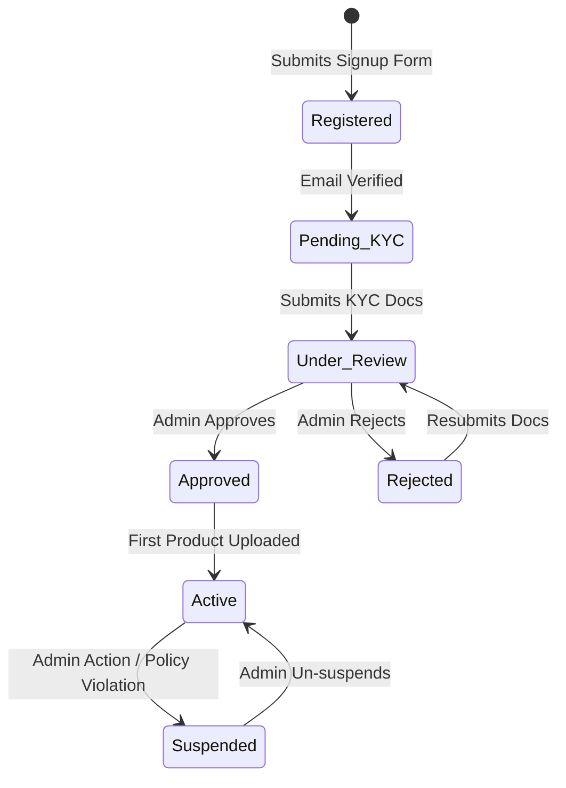

# SUPPLIER MODULE
## Rozi Khan Dropshipping Platform

**Document Version:** 1.0
**Author:** Senior Product Architect

---

## 1. Module Overview
The Supplier Module is the backbone of the Rozi Khan dropshipping ecosystem. It provides wholesale distributors, manufacturers, and brands with a dedicated portal to list products, sync inventory, define pricing margins, and fulfill orders routed automatically from independent retailers.

---

## 2. Supplier Lifecycle & Workflows

### 2.1 State Diagram: Supplier Account Lifecycle

### 2.2 Core Workflows
1. **Registration:** Supplier creates an account via email and OTP verification.
2. **KYC Verification:** Uploads business registration, tax ID (GST/VAT), and bank details.
3. **Approval Workflow:** Super Admin reviews documents and approves the supplier. Only approved suppliers can upload products.
4. **Product Upload:** Supplier uploads products manually (UI) or via bulk CSV import.
5. **Inventory Management:** Supplier sets available stock. Updates can be manual or via API.
6. **Pricing Management:** Supplier defines base wholesale price. (Retailers will add their margin later).
7. **Shipping Configuration:** Supplier defines warehouse locations and default shipping carriers/SLAs.
8. **Order Fulfillment:** 
   - Receives routed order.
   - Packs item.
   - Generates AWB/Label (via integration like Shiprocket).
   - Marks as Shipped.
9. **Returns Management:** Processes RMAs (Return Merchandise Authorizations). Inspects returned goods and approves/rejects refunds.

---

## 3. Supplier Dashboard

The Supplier Dashboard provides a bird's-eye view of their operations.
* **Widgets:** Today's Orders, Pending Fulfillments, Low Stock Alerts, Total Revenue (Wholesale).
* **Navigation:** Catalog, Inventory, Orders, Returns, Payments/Payouts, Settings, Integration Logs.

---

## 4. Supplier Analytics

* **Metrics:** Top Selling Products, Fulfillment Rate (Orders shipped within SLA), Return Rate.
* **Reports:** Monthly payout statements, CSV exports of historical orders.

---

## 5. Database Tables (Module Specific)

| Table Name | Purpose | Key Fields |
| :--- | :--- | :--- |
| `suppliers` | Core business profile | `user_id` (PK), `company_name`, `tax_id`, `verification_status` |
| `supplier_documents` | KYC storage | `id`, `supplier_id`, `doc_type`, `file_url`, `status` |
| `supplier_settings` | Preferences | `supplier_id`, `default_dispatch_days`, `auto_accept_orders` |
| `supplier_warehouses`| Shipping origins | `id`, `supplier_id`, `address`, `city`, `zipcode` |
| `payouts` | Ledger for supplier payments | `id`, `supplier_id`, `amount`, `status`, `processed_at` |

*(Note: Products, Variants, and Inventory tables are shared across the system but strongly tied to `supplier_id`).*

---

## 6. API Endpoints (Module Specific)

* `POST /suppliers/register` - Create account.
* `POST /suppliers/kyc` - Upload documents.
* `GET /suppliers/dashboard` - Fetch KPI metrics.
* `POST /suppliers/products/bulk` - Upload CSV of products.
* `PATCH /suppliers/inventory/{variant_id}` - Update stock.
* `GET /suppliers/orders?status=PENDING` - Fetch orders needing fulfillment.
* `POST /suppliers/orders/{order_id}/ship` - Submit tracking details.

---

## 7. User Stories

1. **As a Supplier**, I want to upload my catalog via CSV so that I don't have to enter hundreds of products manually.
2. **As a Supplier**, I want to receive an email notification when an order is placed, so I can fulfill it quickly.
3. **As a Supplier**, I want to define my processing time (e.g., 2 days) so retailers know when to expect shipment.
4. **As an Admin**, I want to review uploaded tax documents before a supplier goes live to ensure platform quality and legal compliance.

---

## 8. Business Rules

1. **Pricing Floor:** A supplier cannot set a wholesale price of 0.00.
2. **Exclusivity:** Products belong solely to the supplier that uploaded them.
3. **Fulfillment SLA:** Suppliers must update an order's status to `SHIPPED` within their stated dispatch window, otherwise the system flags their account.
4. **Payouts:** Suppliers are credited to their platform wallet only after the order status reaches `DELIVERED` + 7 days (return window).

---

## 9. Security Rules

1. **Strict Isolation:** A supplier's API token must NEVER return products, orders, or data belonging to another supplier. (Enforced via `supplier_id` DB scoping in all queries).
2. **Retailer Anonymity:** Suppliers should only see the necessary shipping details of the end-customer. Retailer margins and other retailer business data are hidden from the supplier.
3. **Document Security:** KYC documents are stored in private S3 buckets and accessed via temporary signed URLs.

---

## 10. Edge Cases

1. **Stock Collision:** Supplier updates stock to 0 exactly as a Retailer's customer checks out. 
   * *Resolution:* Database transaction uses `SELECT ... FOR UPDATE`. The checkout fails, and the customer is notified.
2. **Supplier Deletion:** Supplier wants to close their account, but they have pending orders.
   * *Resolution:* Account goes into `PHASING_OUT` state. No new orders accepted, but existing must be fulfilled or cancelled before full deletion.
3. **CSV Upload Errors:** A 5,000-row CSV contains 5 invalid rows.
   * *Resolution:* Process the 4,995 valid rows. Return a downloadable error log for the 5 failed rows rather than failing the entire batch.

---

## 11. Implementation Roadmap

**Phase 1: Foundation (Weeks 1-2)**
* Supplier Registration & Authentication flows.
* KYC Document Upload (S3/Cloudinary integration).
* Admin Verification Workflow.

**Phase 2: Catalog Management (Weeks 3-4)**
* UI/API for manual Product and Variant creation.
* Background worker (Celery) for parsing CSV bulk uploads.
* Inventory setting and updating APIs.

**Phase 3: Order & Fulfillment (Weeks 5-6)**
* Supplier Order Dashboard (view routed orders).
* Integration with Shipping APIs to generate AWB labels.
* Status update webhooks (Marking items as processing/shipped).

**Phase 4: Finance & Analytics (Weeks 7-8)**
* Supplier Dashboard Widgets and reporting queries.
* Payout calculation engine (Gross Wholesale - Commission).
* Returns/RMA processing workflows.
