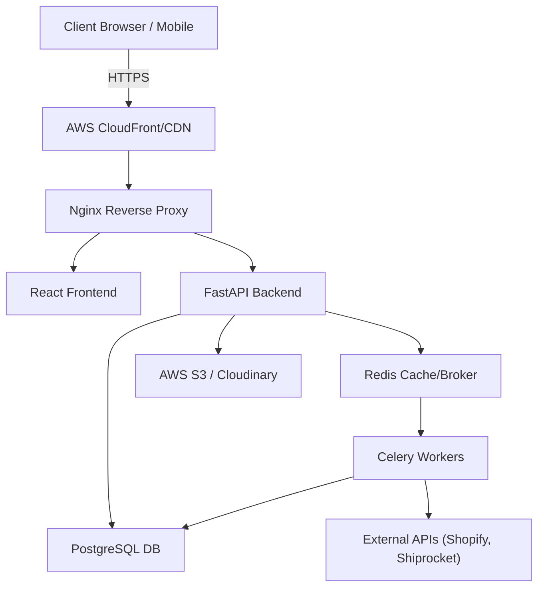
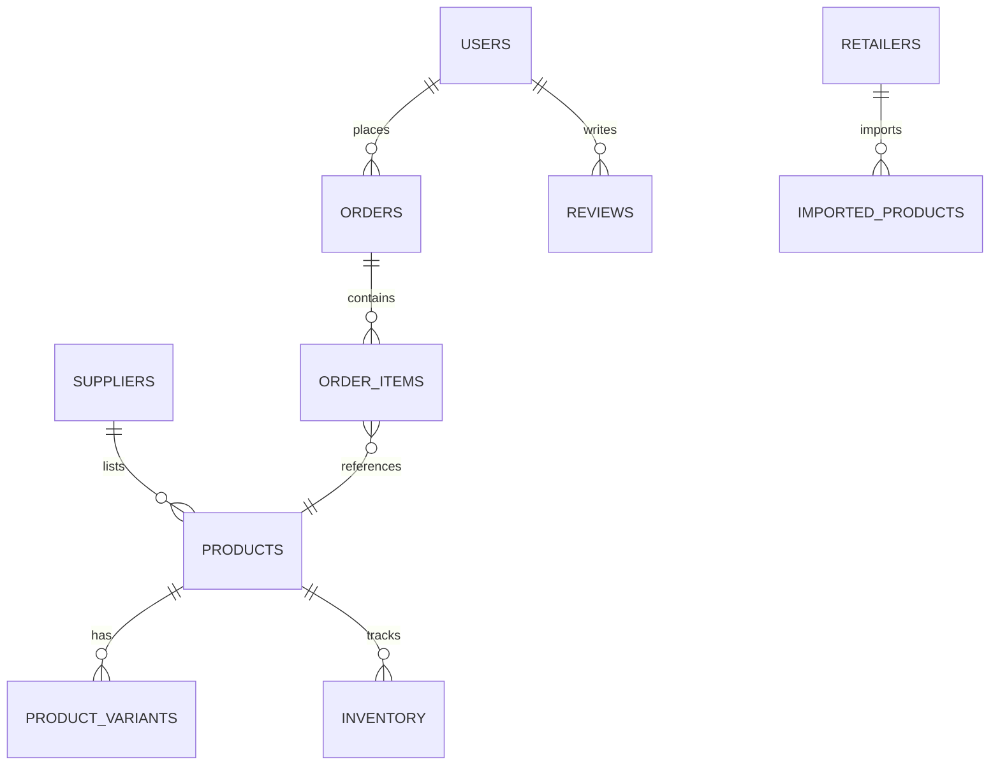
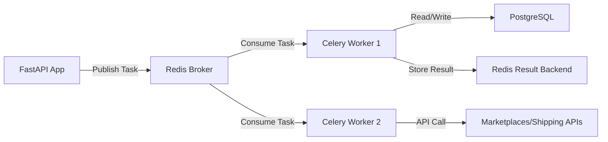
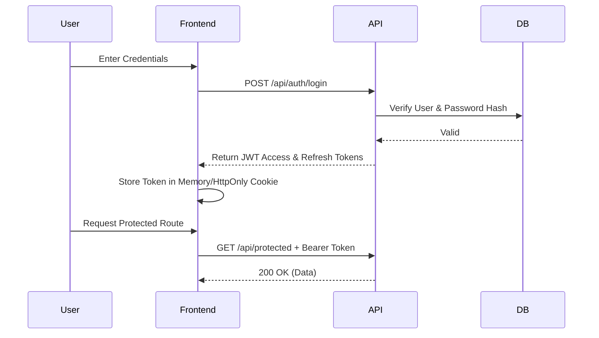
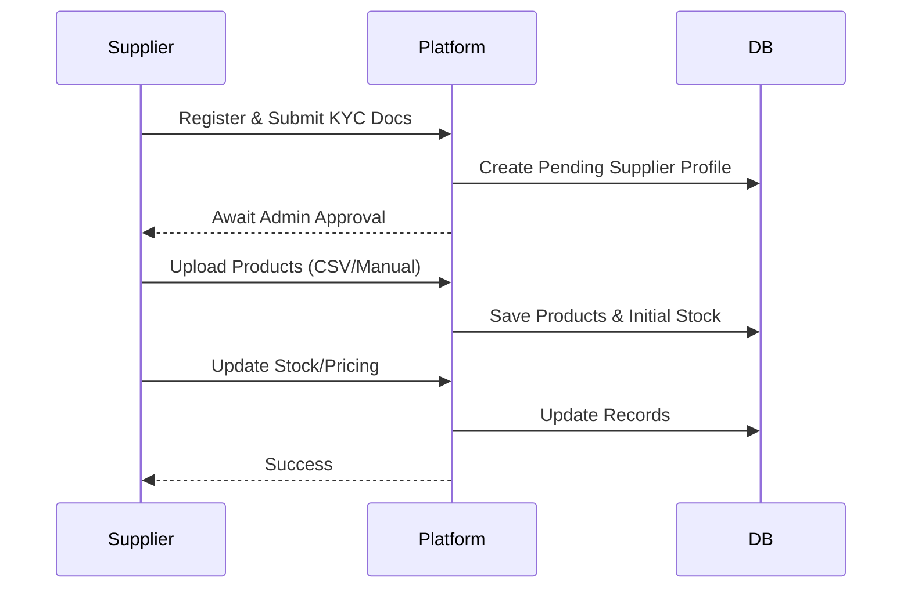
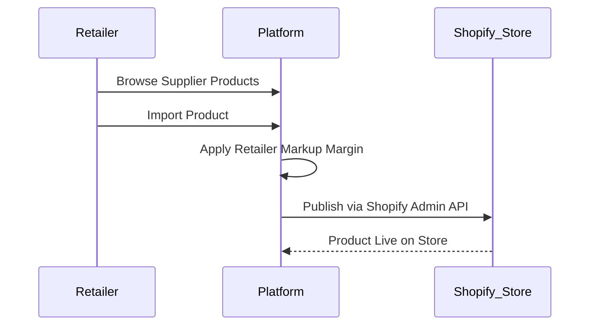
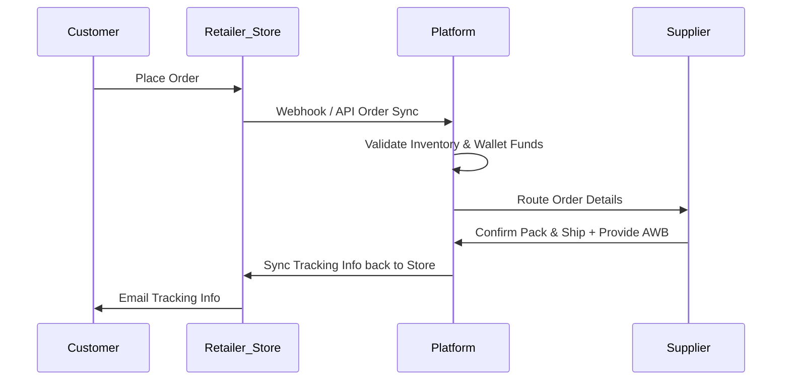
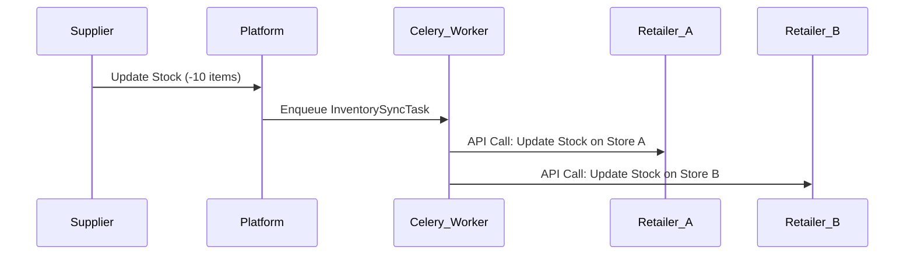
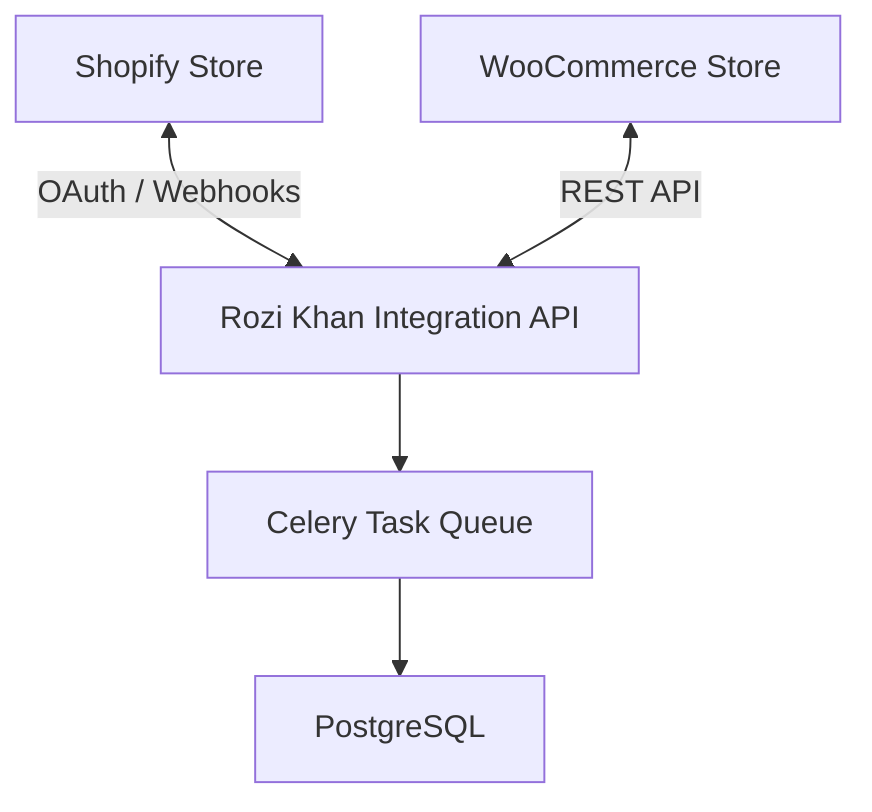
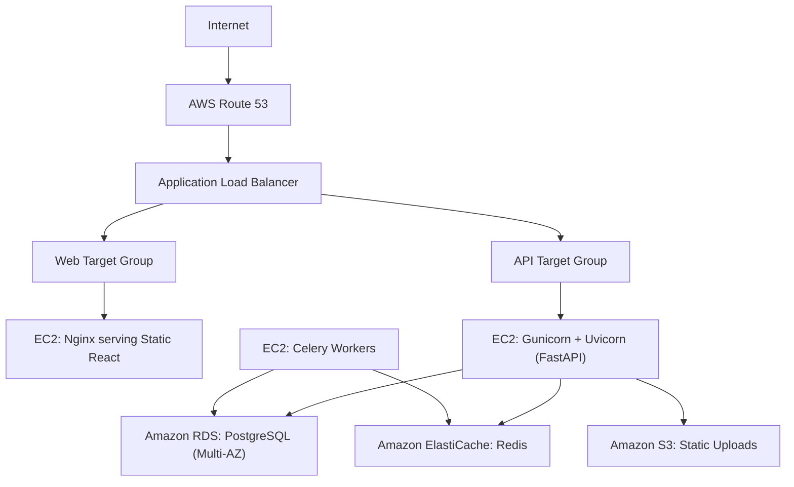

# SYSTEM ARCHITECTURE
## Rozi Khan Dropshipping Platform

**Document Version:** 1.0
**Author:** Senior Software Architect

---

## 1. High-Level Architecture

The Rozi Khan platform employs a modern decoupled architecture. The React frontend interacts with the FastAPI backend over REST. Background operations are offloaded to Celery via Redis.

## 2. Frontend Architecture
* **Framework:** React 19 + Vite for high-performance builds.
* **Routing:** React Router DOM v7 for declarative client-side routing.
* **State Management:** React Context API (with hooks) for global state (Auth, Cart, User Profile).
* **Styling:** Tailwind CSS v4 for utility-first responsive design.
* **Network Layer:** Axios interceptors for automatically attaching JWT tokens and handling 401 refresh flows.
* **Structure:** Separated into `Pages`, `Components`, `Services` (API calls), `Hooks`, and `Context`.

## 3. Backend Architecture
* **Framework:** FastAPI (Python) for asynchronous, high-throughput REST API generation.
* **Server:** Uvicorn (ASGI) running behind Gunicorn (WSGI) in production.
* **Validation:** Pydantic for strict schema definition, request validation, and serialization.
* **ORM:** SQLAlchemy 2.0 (Async) interacting with PostgreSQL.
* **Migrations:** Alembic for database version control.
* **Design Pattern:** Layered architecture (`Routers` -> `Services/Controllers` -> `Models/Database`).

## 4. Database Architecture
PostgreSQL is the source of truth for all structured relational data.

## 5. Redis Architecture
Redis serves multiple high-speed operational roles:
* **Message Broker:** Acts as the task queue broker for Celery.
* **Caching Layer:** Caches expensive analytical queries (e.g., Admin Dashboard stats), product catalogs, and active sessions.
* **Rate Limiting:** Backs the `slowapi` implementation to prevent API abuse.
* **Pub/Sub:** Handles real-time websocket notifications for inventory alerts.

## 6. Celery Architecture
To keep API response times low, heavy computing is handled asynchronously.

## 7. File Storage Architecture
* **Local / Temp:** The `/uploads` directory is used during development or for processing temporary CSV imports.
* **Cloud Storage:** Images and documents are offloaded to **Cloudinary** (or AWS S3).
* **Delivery:** Assets are served via CDN to reduce server load and decrease latency.

## 8. Authentication Flow
Authentication is stateless, utilizing JSON Web Tokens (JWT).

## 9. Authorization Flow
* **Role-Based Access Control (RBAC):** Users are assigned roles (`SUPER_ADMIN`, `SUPPLIER`, `RETAILER`, `CUSTOMER`).
* **FastAPI Dependencies:** Custom `Depends` functions inject the current user and verify their role before the router logic executes. If unauthorized, a `403 Forbidden` is thrown immediately.

## 10. Supplier Workflow

## 11. Retailer Workflow

## 12. Order Workflow

## 13. Inventory Sync Workflow
When a supplier changes stock, or an order depletes stock, it must be synced globally.

## 14. Shipping Workflow
* **Integration:** Direct API integration with aggregators like Shiprocket.
* **Automated Logic:** When an order transitions to `PROCESSING`, a Celery task fetches shipping rates, generates a label, and acquires an AWB (Airway Bill).
* **Supplier Interface:** Suppliers can download and print the auto-generated PDF shipping label directly from their dashboard.

## 15. Marketplace Integration Workflow

## 16. Notification Workflow
* **Event Triggers:** Events (e.g., Order Placed, Low Stock) trigger internal signals.
* **Celery Dispatch:** The signal queues an email/SMS task.
* **Providers:** Resend API handles transactional emails. SMS is dispatched via local providers (e.g., Twilio/Fast2SMS).

## 17. AWS Deployment Architecture

## 18. Scaling Strategy
* **Horizontal Scaling (API):** Because JWT auth is stateless, FastAPI nodes can be duplicated infinitely behind the Application Load Balancer.
* **Worker Scaling (Background):** Celery workers can be added dynamically to instances as queue depth increases (monitored via CloudWatch).
* **Database Scaling:** Implement read replicas in RDS for heavy analytical queries generated by Admin dashboards.

## 19. Security Architecture
* **Encryption at Rest:** AWS RDS and S3 configured with KMS encryption.
* **Encryption in Transit:** Strict TLS/SSL via ACM on the Load Balancer.
* **Secrets Management:** Sensitive keys (Razorpay, JWT Secret, DB passwords) stored in AWS Secrets Manager or standard `.env` securely injected via CI/CD.
* **SQL Injection:** Mitigated via SQLAlchemy ORM parameterized queries.
* **XSS / CSRF:** Handled inherently by React's rendering engine and secure, HttpOnly cookie configurations where applicable.
